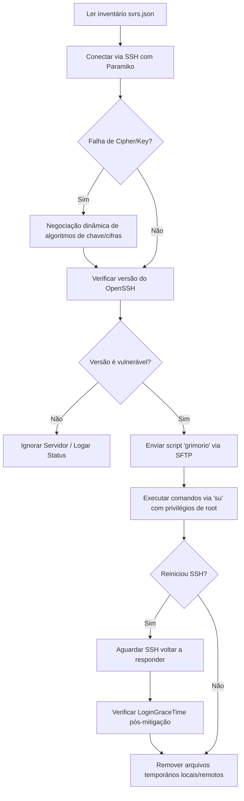

# 🛡️ Automação de Mitigação de Vulnerabilidade SSH (regreSSHion - CVE-2024-6387)

Este repositório contém uma solução automatizada em Python para identificar e mitigar a vulnerabilidade **regreSSHion (CVE-2024-6387)** em múltiplos servidores Linux sob demanda.

A ferramenta realiza de forma centralizada e automatizada a varredura, detecção de vulnerabilidade baseada na versão do OpenSSH, aplicação de correções (mitigação via alteração de configuração), reinicialização segura do serviço e auditoria pós-aplicação.

---

## 📌 O Problema Solucionado

A vulnerabilidade **CVE-2024-6387** (conhecida como **regreSSHion**) afeta o servidor OpenSSH (`sshd`) em sistemas operacionais baseados em Linux. Ela permite a execução remota de código (RCE) como `root` sem autenticação prévia em sua configuração padrão.

As versões vulneráveis do OpenSSH incluem:
- Versões anteriores a **4.4p1** (a menos que patcheadas para CVE-2006-5051 e CVE-2008-4109).
- Versões de **8.5p1** até anteriores a **9.8p1**.

### O Desafio
Em infraestruturas corporativas, *on-premises* ou híbridas contendo dezenas de servidores Linux:
1. Validar manualmente a versão do OpenSSH em cada servidor é um processo lento e ineficiente.
2. Atualizar todos os pacotes pode não ser viável imediatamente por conta de dependências ou restrição de janelas de manutenção.
3. Aplicar manualmente a mitigação recomendada de segurança — alterar a diretiva `LoginGraceTime` para `0` no arquivo `/etc/ssh/sshd_config` — em larga escala é suscetível a erros manuais e pode deixar servidores desprotegidos ou inacessíveis.

---

## 🛠️ A Solução: `gvulsshd.py`

O script `gvulsshd.py` resolve esse problema ao automatizar todo o ciclo de mitigação de ponta a ponta a partir de uma única máquina de gerência. Ele orquestra os seguintes passos:



### Principais Diferenciais
*   **Negociação Dinâmica de Cifras:** Lida de forma inteligente com servidores antigos que usam algoritmos de chave e cifras desatualizados/desabilitados por padrão no cliente Paramiko, renegociando as chaves dinamicamente de acordo com o que o servidor oferece na tentativa falha.
*   **Elevação Segura de Privilégios (`su`):** Solicita as senhas de forma interativa e segura (usando o módulo `getpass`), evitando credenciais expostas em arquivos de texto.
*   **Validação Pós-Mitigação integrada:** Garante que o serviço SSH foi reiniciado com sucesso, aguarda o restabelecimento da conectividade (`wait_for_ssh`) e inspeciona o arquivo `/etc/ssh/sshd_config` remoto para confirmar se a configuração `LoginGraceTime 0` foi de fato aplicada corretamente.

---

## 📁 Estrutura do Projeto

*   **`gvulsshd.py`**: O script principal em Python que realiza a conexão SSH, validação da versão do OpenSSH, transferência e execução das mitigações.
*   **`svrs.json`**: Inventário estruturado em JSON contendo a lista de servidores a serem analisados, suas respectivas portas, usuários e comandos específicos de verificação de pacotes (e.g. `dpkg` ou `rpm`).
*   **`grimorio`**: Arquivo de texto puro que funciona como um "grimório" de comandos shell script a serem executados como `root` nos servidores identificados como vulneráveis.

---

## 🚀 Como Usar

### 1. Pré-requisitos

Certifique-se de ter o Python 3.x e a biblioteca `paramiko` instalados na sua máquina de gerenciamento:

```bash
pip install paramiko
```

### 2. Configurar o Inventário (`svrs.json`)

Edite o arquivo `svrs.json` adicionando os seus servidores. O script usa o campo `command` para rodar o comando correto de checagem baseado na distribuição Linux de cada máquina:

```json
[
  {
    "host": "192.168.0.14",
    "port": 22,
    "username": "seu_usuario",
    "command": "dpkg -l | grep openssh-server",
    "_comentario": "Servidor TACACS+"
  },
  {
    "host": "192.168.0.10",
    "port": 22,
    "username": "seu_usuario",
    "command": "rpm -qi openssh-server",
    "_comentario": "Servidor XCP-NG 3"
  }
]
```

### 3. Configurar a Mitigação (`grimorio`)

O arquivo `grimorio` contém as instruções em Shell Script que serão executadas como root nos servidores vulneráveis. Por padrão, ele realiza a mitigação da vulnerabilidade regreSSHion (faz backup da config, altera `LoginGraceTime` para `0` e reinicia o serviço):

```bash
cp /etc/ssh/sshd_config /etc/ssh/sshd_config_ORI
sed -i 's/^#\?\(LoginGraceTime\)\s\+.*/\1 0/' /etc/ssh/sshd_config
systemctl restart ssh
```

### 4. Executar a Automação

Basta executar o script Python na pasta onde estão os arquivos de configuração:

```bash
python3 gvulsshd.py
```

O terminal exibirá informações claras de progresso e solicitará de forma interativa a senha de SSH do usuário de login e a senha do `root` para a elevação de privilégios.

---

## 🔒 Boas Práticas de Segurança Aplicadas

1.  **Credenciais Seguras:** Nenhuma senha ou chave privada é persistida em disco ou em arquivos de configuração. O script utiliza `getpass.getpass()` para a entrada segura de credenciais diretamente na memória operacional do terminal.
2.  **Salvaguarda de Configuração:** Antes de alterar as configurações de SSH do sistema, o script gera um backup seguro (`sshd_config_ORI`), permitindo um rápido *rollback* se necessário.
3.  **Higiene de Ambiente (Limpeza de Rastros):** O script remove automaticamente o script temporário `/tmp/temp_script.sh` tanto na máquina local quanto nos servidores remotos após o término da execução.